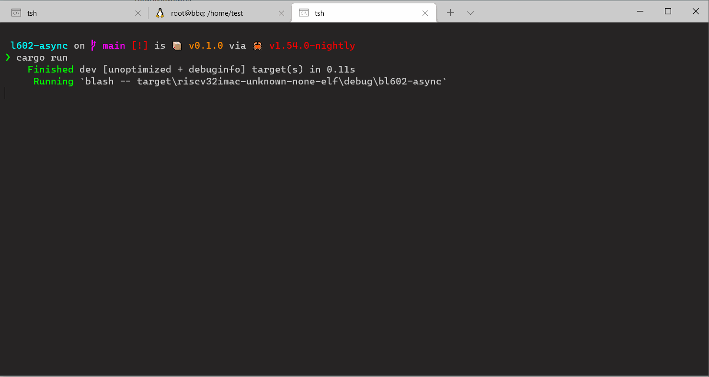

# BLASH - Zero Touch BL602 Flasher

A tool to flash BL602 via JTAG + serial without pressing buttons / setting jumpers.

Additionally it provides a simple serial monitor to show serial output from your application.



## How it works

It downloads the eflasher binary to RAM via JTAG. Then it starts the elfasher and transfers the binary
you want to flash via serial.

The serial flashing is done by code from @Spacemeowx2's wonderful BLFLASH. Basically everything in the `blflash` module is copied from https://github.com/spacemeowx2/blflash

Unfortunately I had to copy the code since BLFLASH and probe-rs use clashing dependencies.

## Command Line

```
USAGE:
    blash.exe [FLAGS] [OPTIONS] [--] <file>

FLAGS:
    -h, --help          Prints help information
        --no-monitor
        --rtt
    -V, --version       Prints version information

OPTIONS:
        --baud <baud>                     [default: 2000000]
        --monitor-baud <monitor-baud>     [default: 115200]
        --port <port>

ARGS:
    <file>
```

This way you can just use it in `.cargo/config` like this:
```
...
runner = "blash --"
...
```

The _port_ argument is optional if only one serial port is found. Otherwise it's mandatory.

## Installation

For now clone this repository and run:

```
cargo install --path .
```

## Experimental Features

Instead of the serial monitor you can enable RTT support via `--rtt`.

See https://github.com/bjoernQ/bl602-rtt-example how to use it.

Additionally there is support for backtraces generated by _blash_.
Also see the above mentioned example for that.

If you don't get full backtraces you should compile the target application like `cargo build -Z build-std=core --target riscv32imc-unknown-none-elf` to make sure there is unwind info for all the code.

## Good to Know

This is hopefully just a temporary solution and we get https://github.com/9names/bl602-loader working someday.

If something is not working or can get improved create an issue or send an PR.

I only tested this on Windows with an Sipeed JTAG adapter.

If you get an error regarding communicating to the debug probe - just try again. Hope to get this fixed.
